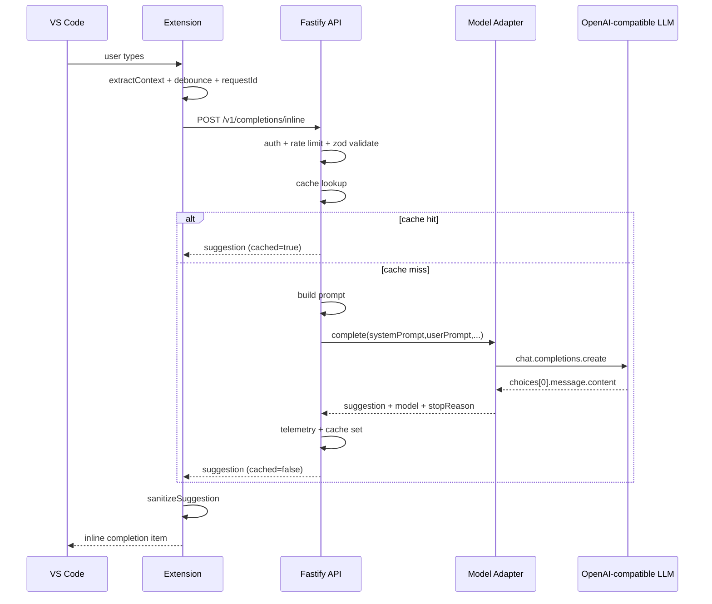

# System Visualize (File Map)

This document visualizes how the current MVP works, and maps each runtime step to concrete files.

## 1) End-to-end runtime flow

```mermaid
flowchart LR
    U[Developer typing in VS Code]
    E1[apps/extension/src/extension.ts\nregister provider]
    E2[apps/extension/src/providers/inlineCompletionProvider.ts\nextract context + debounce + requestId]
    E3[apps/extension/src/services/completionClient.ts\nPOST /v1/completions/inline]
    A1[apps/api/src/app.ts\nFastify app + hooks + service wiring]
    A2[apps/api/src/middleware/auth.ts\nAPI key check]
    A3[apps/api/src/middleware/rateLimit.ts\nrate limit by key/ip]
    A4[apps/api/src/routes/inlineCompletion.ts\nvalidate request/response schema]
    A5[apps/api/src/services/completionService.ts\ncache + prompt + adapter + telemetry]
    P1[apps/api/src/services/promptBuilder.ts\npackages/prompt-kit/src/buildPrompt.ts]
    M1[apps/api/src/adapters/llmProvider.ts\npackages/model-adapter/src/index.ts]
    M2[packages/model-adapter/src/openai.ts\nOpenAI SDK chat.completions.create]
    LLM[OpenAI-compatible endpoint\nMiniMax / Claude-compat / OpenAI]
    E4[apps/extension/src/utils/sanitizeSuggestion.ts\nclean model output]
    UI[Inline suggestion shown\nTab to accept]

    U --> E1 --> E2 --> E3 --> A1
    A1 --> A2 --> A3 --> A4 --> A5
    A5 --> P1
    A5 --> M1 --> M2 --> LLM
    LLM --> M2 --> A5 --> A4 --> E3 --> E4 --> UI
```



## 2) Sequence view (single completion request)



## 3) File responsibility map

### Extension app (`apps/extension`)

- `apps/extension/src/extension.ts`: activates extension and registers inline provider.
- `apps/extension/src/config/settings.ts`: loads `openSuggest.*` VS Code settings.
- `apps/extension/src/providers/inlineCompletionProvider.ts`: orchestrates request lifecycle in editor.
- `apps/extension/src/utils/contextExtractor.ts`: slices prefix/suffix around cursor.
- `apps/extension/src/services/debounce.ts`: request frequency gate per document key.
- `apps/extension/src/services/completionClient.ts`: HTTP client, timeout, schema-safe parse.
- `apps/extension/src/utils/sanitizeSuggestion.ts`: strips fences/cleanup before rendering.

### API app (`apps/api`)

- `apps/api/src/server.ts`: process entrypoint.
- `apps/api/src/app.ts`: DI wiring for env, middleware, services, and routes.
- `apps/api/src/config/env.ts`: maps env vars -> runtime config.
- `apps/api/src/middleware/auth.ts`: enforces optional `x-api-key` (skips `/health`).
- `apps/api/src/middleware/rateLimit.ts`: in-memory per-minute limiter (skips `/health`).
- `apps/api/src/routes/health.ts`: liveness route.
- `apps/api/src/routes/inlineCompletion.ts`: request validation and response validation.
- `apps/api/src/services/completionService.ts`: cache, prompt call, adapter call, telemetry.
- `apps/api/src/services/promptBuilder.ts`: converts request to prompt-kit input.
- `apps/api/src/services/cacheService.ts`: simple in-memory TTL cache.
- `apps/api/src/services/telemetryService.ts`: structured completion logs.
- `apps/api/src/adapters/llmProvider.ts`: creates configured model adapter.

### Shared packages (`packages/*`)

- `packages/shared-types/src/inlineCompletion.ts`: Zod schemas and TS types for API IO.
- `packages/shared-types/src/common.ts`: common API error schema.
- `packages/prompt-kit/src/buildPrompt.ts`: system/user prompt construction.
- `packages/model-adapter/src/base.ts`: model adapter contracts.
- `packages/model-adapter/src/index.ts`: adapter factory + fallback composition.
- `packages/model-adapter/src/openai.ts`: OpenAI SDK wrapper for OpenAI-compatible endpoints.

## 4) Data shape transitions

```text
Editor context
  -> { language, filePath, cursor, prefix, suffix, editor, requestId }
  -> /v1/completions/inline (validated by shared-types)
  -> promptBuilder => { systemPrompt, userPrompt }
  -> model-adapter request => {
       model, temperature, max_tokens, messages,
       + optional headers,
       + optional provider extra body
     }
  -> LLM response choices[0].message.content
  -> API response { suggestion, stopReason, model, latencyMs, cached }
  -> extension sanitize + render inline
```

## 5) Config path map

- Extension runtime config: `apps/extension/src/config/settings.ts`
  - `openSuggest.apiBaseUrl`
  - `openSuggest.apiKey`
  - `openSuggest.requestTimeoutMs`
  - `openSuggest.debounceMs`

- API runtime config: `apps/api/src/config/env.ts`
  - `OPEN_SUGGEST_OPENAI_API_KEY`
  - `OPEN_SUGGEST_OPENAI_BASE_URL`
  - `OPEN_SUGGEST_OPENAI_MODEL`
  - `OPEN_SUGGEST_OPENAI_FALLBACK_MODEL`
  - `OPEN_SUGGEST_OPENAI_HEADERS_JSON`
  - `OPEN_SUGGEST_OPENAI_EXTRA_BODY_JSON`
  - `OPEN_SUGGEST_API_KEY`
  - `OPEN_SUGGEST_TIMEOUT_MS`
  - `OPEN_SUGGEST_CACHE_TTL_MS`
  - `OPEN_SUGGEST_RATE_LIMIT_PER_MIN`

## 6) External boundary

The only external LLM boundary is in `packages/model-adapter/src/openai.ts`, via OpenAI SDK chat completions.
Any OpenAI-compatible provider is selected by changing base URL, model, headers, and optional extra body in env.
